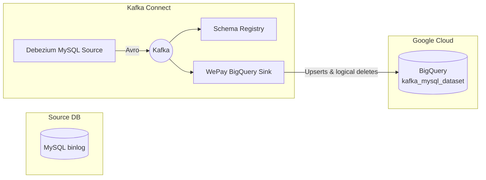

# Kafka -> BigQuery CDC Pipeline <!-- omit in toc -->

> **MySQL ▸ Debezium ▸ Kafka ▸ BigQuery** – an end-to-end change-data-capture stack orchestrated entirely with Docker Compose.

## Overview

This repository demonstrates how to stream row-level changes from **MySQL** into **Google BigQuery** in near-real-time:

* **Debezium MySQL Source Connector** tails the MySQL binary log and publishes Avro change events (insert, update, delete) to Kafka.
* **Kafka Broker** provides durable, replayable storage for those events.
* **Confluent Schema Registry** houses the Avro schemas so producers and consumers remain compatible over time.
* **WePay BigQuery Sink Connector** consumes the topics, performs idempotent upserts in BigQuery, and marks logical deletes with a boolean `__deleted` column.

Everything runs locally inside Docker containers; the only external dependency is a GCP project + service account so the sink can write to BigQuery.

## Architecture


Change events flow left -> right. Debezium produces; the sink consumes.

## Quick-start

### 1 · Clone the repo

```bash
git clone git@github.com:<your-user>/kafka-bq-pipeline.git
cd kafka-bq-pipeline
```

---

### 2 · Set the environment variables

Create a `.env` file (it’s already in `.gitignore`) with **your** GCP details:

```ini
GCP_PROJECT=
BQ_DATASET=
BQ_BUCKET=
BQ_KEYFILE=./bq-sa.json      # relative to the compose file
```

> 🔑 **Download** the service-account key JSON from Cloud Console and place it at the path you declare above.

---

### 3 · Spin up the stack

```bash
docker compose up -d
```

The compose file starts **MySQL**, **Kafka** (broker + schema-registry + connect), and the **WePay BigQuery sink** image.

---

### 4 · Seed MySQL with sample data
```bash
# In your root repo directory:
docker cp ./sql-scripts/mysql.sql mysql2:/tmp/mysql.sql

# Execute it via STDIN
docker exec -i mysql2 \
  mysql -u root -proot < /tmp/mysql.sql
```

---

### 5 · Register the connectors

```bash
# Debezium MySQL source
curl -X POST localhost:8083/connectors \
  -H "Content-Type: application/json" \
  -d @connectors/mysql/mysql-avro.json

# WePay BigQuery sink
curl -X POST localhost:8083/connectors \
  -H "Content-Type: application/json" \
  -d @connectors/bigquery/bq-json.json
```

Both JSON files live in `connectors/` and reference the variables you set in **Step 2**.

---

### 6 · Watch the data flow

```bash
# Tail connector logs
docker logs -f connect
```

```bash
# Peek at the topic
docker exec -it broker env -u KAFKA_OPTS \
  kafka-console-consumer --bootstrap-server broker:9092 \
  --topic dcs-demo1.ecomm.users --from-beginning --max-messages 5
```

---

### 7 · Query BigQuery

```bash
bq query --use_legacy_sql=false \
'SELECT user_id, username, __deleted, messageTS
   FROM `'${GCP_PROJECT}'.'${BQ_DATASET}'.dcs_demo1_ecomm_users`
   ORDER BY messageTS DESC
   LIMIT 20;'
```

Try DML statements in MySQL and re-run the query, you should see that:

* changes reflect almost immediately   (~5-30 seconds)
* deletes flagged with `__deleted = TRUE`

## Connectors in detail

### Debezium MySQL _source_

| Property | Value (excerpt) | Purpose |
|----------|-----------------|---------|
| `connector.class` | `io.debezium.connector.mysql.MySqlConnector` | Tails the bin-log and emits change events. |
| `transforms` | `unwrap` | Strips the Debezium envelope. |
| `transforms.unwrap.delete.handling.mode` | `rewrite` | Converts hard deletes into records that carry a payload plus a `"__deleted" = true` flag. |
| `transforms.unwrap.drop.tombstones` | `false` | Keep *real* tombstones so the sink can distinguish logical deletes. |
| … | … | See **`connectors/mysql-avro.json`** for a full listing. |

---

### WePay BigQuery _sink_

| Property | Value | Purpose |
|----------|-------|---------|
| `autoCreateTables` | `true` | Create tables on the fly using the Avro schema. |
| `upsertEnabled` | `true` | Primary-key based *INSERT … ON DUPLICATE UPDATE*. |
| `deleteEnabled` | `true` | When `__deleted = true` the row is removed (soft-delete). |
| `transforms` | `dropTombstone` | A Kafka Connect *Filter SMT* that discards **pure** tombstone messages (value = null) which otherwise break schema unioning. |
| … | … | Full spec lives in **`connectors/bq-json.json`**. |

---

## Tombstone handling

1. **Debezium still sees two “delete” events inside the MySQL bin-log**  
   * _logical-delete_ row → value **has schema & payload** plus `op:"d"`  
   * Kafka-level _tombstone_ → **value = null** (used only for topic compaction)  
2. In **our** pipeline we discard the tombstone **before it ever reaches Kafka**:

   ```jsonc
   // Debezium MySQL source → ExtractNewRecordState SMT
   "transforms.unwrap.delete.handling.mode": "rewrite",   // adds "__deleted" = true
   "transforms.unwrap.drop.tombstones":      "true",      // do NOT forward tombstones
   "tombstones.on.delete":                   "false"      // redundant safeguard
**Result**: only the logical-delete record is published, so downstream components never
see a null value and BigQuery’s “schema must be struct” error cannot occur.

3. **BigQuery removal strategy**  
   * We rely on idempotent upserts (`upsertEnabled: true`). 
   * When a record arrives with `__deleted = true`, the sink flags the __deleted field as true for the corresponding deleted row.

#### Current connector snippets (abridged)
```
// Debezium MySQL **source** (mysql6)
{
  "connector.class": "io.debezium.connector.mysql.MySqlConnector",
  "topic.prefix": "dcs-demo1",

  "transforms": "unwrap",
  "transforms.unwrap.type": "io.debezium.transforms.ExtractNewRecordState",
  "transforms.unwrap.delete.handling.mode": "rewrite",
  "transforms.unwrap.drop.tombstones": "true",
  "tombstones.on.delete": "false",
  "transforms.unwrap.add.fields": "op,ts_ms"

  // …other MySQL & schema-registry settings
}
```

```
// WePay BigQuery **sink** (bqkc2)
{
  "connector.class": "com.wepay.kafka.connect.bigquery.BigQuerySinkConnector",

  "project":        "${env:GCP_PROJECT}",
  "defaultDataset": "${env:BQ_DATASET}",
  "gcsBucketName":  "${env:BQ_BUCKET}",
  "keyfile":        "${env:BQ_KEYFILE}",

  "topics.regex": "^(dcs-demo1\\.ecomm\\.(users|products|orders|order_items))$",

  "upsertEnabled": "true",                // MERGE by primary key
  /* deleteEnabled omit — we rely on "__deleted=true" flag from source */

  "autoCreateTables":                     "true",
  "allowNewBigQueryFields":               "true",
  "allowBigQueryRequiredFieldRelaxation": "true",
  "allBQFieldsNullable":                  "true",

  "transforms":
    "RenameUserKey,RenameProductKey,RenameOrderKey,RenameOrderItemKey,insertTS,formatTS"

  // …predicate & SMT configs follow
}
```

#### Outcome
MySQL `DELETE` -> Debezium rewrite record (`__deleted=true`) -> BigQuery sink flags the row as deleted -> No tombstones, no schema errors, connectors remain RUNNING.

---

## Local development

| Task | Command |
|------|---------|
| Bring containers up/down (exclude brackets) | `docker compose -f dc.yaml <up/down> -v` |
| Open a MySQL shell | `docker exec -it mysql2 mysql -uroot -proot ecomm` |
| Tail just the sink logs | `docker logs -f connect \| grep -i bigquery` |

> **Tip:** VS Code/VSCodium users can install _Markdown Preview Mermaid Support_ to render the diagram inline.

---

## References & Credits

* **Debezium documentation** – <https://debezium.io/>
* **Kafka Connect BigQuery Sink** – <https://github.com/WePay/kafka-connect-bigquery>
* **Mermaid** – <https://mermaid.js.org/>

---